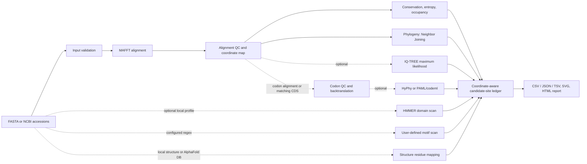

# EvoTrace

### Trace evolutionary evidence from sequence positions into biological context.

[](https://github.com/alperengcmn/EvoTrace/actions/workflows/ci.yml)
[](LICENSE)
[](pyproject.toml)

EvoTrace is a modular, reproducible workflow for comparative sequence analysis. It validates FASTA inputs, aligns homologous sequences, calculates per-position conservation and entropy summaries, and connects optional phylogenetic, codon-selection, domain, motif, and structure analyses to shared residue coordinates. It preserves the provenance and status of each analysis so missing evidence is visible rather than mistaken for a negative result.

> **Scientific scope:** EvoTrace organizes evidence for follow-up. Its default position scores are descriptive summaries, not validated predictors of adaptation or function.



Only configured analyses run. The dotted connections are optional inputs or tools; downstream outputs retain their method and result level.

## Why EvoTrace?

Comparative analyses often leave alignment summaries, tree inference, codon tests, profile hits, motifs, and structural coordinates in separate files with incompatible numbering. EvoTrace provides a common workflow and coordinate-aware candidate-site table to help inspect these results together. It records where each result came from, retains site-, branch-, and gene-level selection findings at their native levels, and marks tools or evidence sources that were not run.

The intended path is:

```text
Sequence → aligned position → evidence → reference residue → biological context
```

Integration improves traceability and review. It does not make heterogeneous results statistically independent or establish a biological mechanism.

## Capabilities

| Layer | Implemented capability | Requirement or interpretation |
|---|---|---|
| Input | FASTA parsing, alphabet checks, ambiguity and identifier validation; optional NCBI protein accession retrieval | NCBI retrieval requires network access |
| Alignment | MAFFT with output validation and alignment QC | MAFFT executable on `PATH` |
| Per-position summaries | Occupancy, gap/ambiguity fractions, dominant-residue frequency, Shannon entropy, normalized entropy, information content, effective alphabet size | Descriptive statistics depend on input sampling and alignment quality |
| Pairwise summaries | Identity matrix and pairwise identity/similarity summaries | Not a model-based evolutionary distance |
| Phylogeny | Internal Neighbor Joining on uncorrected p-distance; optional IQ-TREE maximum-likelihood runner | Neighbor Joining has no branch support; IQ-TREE must be installed for ML inference |
| Codon workflow | Protein-to-codon backtranslation with matching CDS; codon/protein correspondence QC; optional user-provided codon alignment | Matching sequence IDs and translations are checked; genetic code support is constrained by the selected tool |
| Selection | HyPhy FEL, MEME, FUBAR, aBSREL, BUSTED; PAML/codeml branch, site, and branch-site runners with parsed likelihood/BEB outputs | Requires a valid codon alignment, tree where required, and the chosen executable; interpretation remains method-specific |
| Domains | HMMER `hmmscan` with domain coordinates and scores | Requires a local HMM profile database; no profile library is bundled |
| Motifs | Scan configured user-supplied regular expressions and map hits through the alignment | This is regex scanning, not de novo motif discovery |
| Structure | Map reference residues to local PDB/mmCIF or an AlphaFold DB model; retain chain, residue, insertion code, coverage, and confidence metadata | Mapping is contextual; a predicted or experimental structure does not prove function |
| Candidate sites | Per-alignment-position CSV/TSV/JSON with coordinate-aware sequence, selection, domain, motif, and structure fields | Branch/gene results are not converted into site hits; unavailable modalities remain explicit |
| Reports | Portable HTML report, SVG conservation/tree graphics, run summaries, and provenance | Report reflects the analyses actually configured and completed |
| Interface | Local Streamlit workspace over the same pipeline API, with progress, filters, visualizations, and output downloads | Install the `web` extra |

## Scientific workflow

### Core local analysis

The integrated command validates the input and configuration, invokes MAFFT, checks that aligned IDs and lengths remain valid, builds a shared coordinate map, then calculates alignment statistics and exports candidate positions. With at least three aligned sequences, the default tree is Neighbor Joining using uncorrected p-distance. This tree is exploratory and has no bootstrap support.

### External scientific tools

IQ-TREE can replace the default tree when selected in configuration. HyPhy and PAML/codeml are separate codon-selection runners. HMMER scans the input proteins against a profile database supplied by the user. These programs are invoked with argument lists, and their versions, commands, runtime, and bounded logs are recorded where available. Missing optional tools or databases are represented as skipped or unavailable stages.

### Optional remote resources

The CLI can fetch protein records from NCBI E-utilities by accession. Structure mapping can retrieve a model through the public AlphaFold DB API or use a local PDB/mmCIF file. Remote access, service availability, accession coverage, and database versions affect reproducibility; downloaded structures are cached with retrieval metadata.

## Methodology and interpretation

### Alignment statistics

Per-column residue frequencies are calculated over canonical, non-gap symbols. EvoTrace reports Shannon entropy in bits, normalized entropy, dominant-residue frequency, occupancy, gaps, and ambiguity. These summaries describe the supplied alignment; they do not correct for phylogenetic dependence, taxon sampling, or alignment error.

### Codon and selection analyses

When protein sequences and matching coding sequences are provided, EvoTrace backtranslates the protein alignment and checks translation and gap correspondence. A user-provided codon alignment is also checked against the protein alignment when applicable. Pairwise Nei–Gojobori dN/dS is a descriptive estimate using minimum mutation paths and a Jukes–Cantor correction; it is not a likelihood-ratio test.

HyPhy and codeml results retain method-specific statistics and distinguish site, branch, and gene or branch-set results. For example, a PAML BEB posterior is not reported as a p-value. These inferential outputs still depend on their model assumptions, codon alignment, tree, and analysis choices.

### Domains, motifs, and structure

HMMER profile hits, user-defined regex motifs, and mapped structure residues are projected into alignment/reference coordinates. Domain scans require a supplied local profile HMM. Motif scanning uses user patterns. Structural outputs report residue correspondence and metadata such as AlphaFold confidence or coordinate B-factors; they are annotations, not functional assays.

### Interpretation by design

```text
Observed sequence or assay data
              ↓
Computed statistic or method-specific test
              ↓
Coordinate-aware evidence record
              ↓
Biological interpretation by the researcher
```

Keep these distinctions in mind:

- High variability is not evidence of adaptation by itself.
- A pairwise dN/dS estimate above one is not automatically a positive-selection result.
- A motif overlap is not proof of motif activity or causality.
- Structural localization is not proof of functional effect.
- Correlation is not causation.
- An absent tool, database, structure, or hit is unavailable evidence, not evidence for no effect.

### Evolutionary Trace Score (ETS)

The current `ets_descriptive_score` is exactly **normalized entropy × occupancy**. It is an export alias for the divergence summary. EvoTrace also exports a separate constraint summary: **dominant-residue frequency × occupancy**. These are correlated descriptions of the same alignment evidence and must not be counted as independent signals.

ETS is a descriptive alignment proxy. It is not a trained or externally validated adaptive predictor and does not establish positive selection, adaptation, function, or causality. Selection methods are retained as a dependent evidence family; domains, motifs, and structures provide context rather than numeric additions to ETS. Missing modalities are represented by status fields instead of a score of zero.

### Candidate-site records

Candidate rows use 1-based alignment positions, with reference residue positions where a reference sequence is available. Each row includes the alignment summaries, ETS proxy, selection status/method fields, annotation coordinates, and structure residue mapping when computed. Site tests can be mapped to residue rows; branch- and gene-level tests remain in the selection outputs.

| Field group | Example columns |
|---|---|
| Coordinates | `alignment_position`, `reference_position`, `reference_residue` |
| Alignment | `conservation`, `entropy`, `occupancy`, `gap_fraction` |
| Selection | `selection_status`, `selection_method`, `selection_pvalue` |
| Annotation | `domain`, `domain_evalue`, `motif`, `motif_status` |
| Structure | `structure_residue`, `structure_chain`, `structure_confidence` |
| Descriptive score | `constraint_score`, `divergence_score`, `ets_descriptive_score` |

The values above describe the implemented schema, not biological results. Actual columns are also available in the run's `candidate_sites.csv`, `.tsv`, and `.json` files.

## Architecture

The CLI and Streamlit UI call the same analysis pipeline. Scientific modules are kept separate from orchestration and reporting:

```text
src/evotrace/
├── alignment/       MAFFT adapter
├── codon/           Backtranslation and codon QC
├── conservation/    Column metrics and information measures
├── evidence/        Candidate-site evidence ledger and exports
├── io/              FASTA and NCBI access
├── mapping/         Residue and alignment coordinate transforms
├── motifs/          User-pattern scanning
├── phylogeny/       Neighbor Joining
├── pipeline/        Integrated orchestration and stage cache
├── reporting/       HTML report
├── scoring/         Descriptive ETS/constraint summaries
├── selection/       Pairwise dN/dS
├── structure/       PDB/mmCIF and AlphaFold DB mapping
├── tools/           IQ-TREE, HyPhy, PAML/codeml, HMMER adapters
├── validation/      FASTA validation
└── visualization/  SVG output
```

## Reproducibility

Each run records the resolved configuration and its fingerprint, input SHA-256, EvoTrace/Python/platform and available tool versions, UTC timestamp, stage statuses, output hashes, command metadata, runtime, and bounded tool output in `provenance.json` and `pipeline_stages.json`. The stage cache checks fingerprints and output hashes; `--resume` reuses matching successful stages and recomputes changed or tampered outputs. `--dry-run` validates the inputs and reports the planned work before alignment.

Provenance fields include:

```json
{
  "evotrace_version": "0.1.0",
  "input_sha256": "<SHA-256 of input>",
  "configuration_sha256": "<SHA-256 of normalized configuration>",
  "software_versions": {
    "mafft": "<detected version>",
    "biopython": "<detected version>",
    "iqtree": "<detected version or unavailable>",
    "hyphy": "<detected version or unavailable>",
    "paml_codeml": "<detected version or unavailable>",
    "hmmer": "<detected version or unavailable>"
  },
  "stage_status": {},
  "runtime_seconds": 0.0
}
```

Values are illustrative placeholders; a real run records the detected values. Keep the input, configuration, provenance, and tool/database versions together when sharing an analysis. Outputs can vary with external tool versions and remote resources.

## Quick start

### Clone and install

The repository's Conda specification includes Python dependencies and common native tools. After installing Conda or Mamba:

```bash
git clone https://github.com/alperengcmn/EvoTrace.git
cd EvoTrace
conda env create -f environment.yml
conda activate evotrace
python -m pip install -e '.[all]'
```

For a Python-only install, use Python 3.9 or newer and install MAFFT separately for the integrated alignment workflow:

```bash
python3 -m venv .venv
source .venv/bin/activate
python -m pip install -e .
# Install MAFFT using a trusted platform package manager.
```

The `all` extra includes the Streamlit interface and developer tools. The core package dependencies are Biopython, NumPy, and PyYAML. IQ-TREE, HyPhy, PAML/codeml, and HMMER are used only for the corresponding configured or standalone analyses.

### Check the environment

```bash
evotrace doctor
evotrace doctor --strict
```

`doctor` prints detected versions, paths, and installation guidance. `--strict` exits unsuccessfully if any dependency that the current doctor check labels required is missing. See [environment setup](docs/environment.md) for the project's full native-tool verification script.

### Run the included example

```bash
evotrace validate --input examples/tp53_mammals.fasta --alphabet protein
evotrace analyze --config configs/example.yaml --output results/tp53
```

The FASTA contains three NCBI RefSeq mammalian TP53 protein records. It demonstrates software execution, not a comprehensive or orthology-curated evolutionary study; accession provenance is in [examples/README.md](examples/README.md). The YAML configuration resolves its input path relative to the config file. The default phylogeny is Neighbor Joining.

`homologs.fasta` is a synthetic software fixture. The TP53 data are suitable for a small workflow demonstration; for research, define taxa and isoforms explicitly and assess orthology and sequence quality.

## Outputs

The output directory is flat and contains files for configured stages. A representative run includes:

```text
results/tp53/
├── alignment.input.fasta
├── alignment.fasta
├── alignment_qc.json
├── alignment_stats.json
├── alignment_metrics.csv
├── identity_matrix.json
├── evolutionary_trace_scores.json
├── phylogeny.nwk
├── phylogeny.svg
├── phylogeny_summary.json
├── candidate_sites.csv
├── candidate_sites.tsv
├── candidate_sites.json
├── evidence_integration.json
├── conservation.svg
├── report.html
├── provenance.json
├── pipeline_stages.json
└── run_summary.json
```

Optional or input-dependent artifacts include `codon_alignment.fasta`, `codon_alignment_qc.json`, `selection.json`, `domains.json`, `motif_hits.json`, and `structure_mapping.json`. The run summary lists the files generated by that particular analysis; skipped or disabled stages are recorded separately.

## Dependencies

| Dependency | Role | When needed |
|---|---|---|
| Python 3.9+ | Runtime | Always |
| Biopython, NumPy, PyYAML | Sequence I/O, alignment/statistics support, YAML configuration | Core package |
| MAFFT | Multiple sequence alignment in `analyze` | Integrated workflow |
| IQ-TREE 2 | Maximum-likelihood tree inference | When selected instead of default Neighbor Joining, or via standalone command |
| HyPhy | FEL, MEME, FUBAR, aBSREL, BUSTED | When selection analyses are configured |
| PAML/codeml | Branch, site, and branch-site codon models | When selected |
| HMMER 3 | Search sequences against profile HMMs | When domain analysis is enabled |
| pandas, Plotly, Streamlit | Interactive local interface | `pip install -e '.[web]'` or `.[all]` |
| Local HMM profile database | Domain annotation | User supplied; no database is bundled |
| NCBI / AlphaFold DB | Optional sequence or structure retrieval | Network access and matching public records |

See [installation](docs/installation.md) and [environment setup](docs/environment.md) for platform-specific guidance.

## CLI reference

```bash
evotrace --help
evotrace validate --input sequences.fasta --alphabet auto
evotrace analyze --input sequences.fasta --config config.yaml --output results/run
evotrace analyze --config configs/example.yaml --output results/tp53 --dry-run
evotrace analyze --config configs/example.yaml --output results/tp53 --resume
evotrace phylogeny --alignment aligned.fasta --output results/iqtree
evotrace selection --alignment codons.fasta --engine hyphy --method FEL
evotrace selection --alignment codons.fasta --engine paml --model site --tree tree.nwk
evotrace domains --sequences proteins.fasta --database profiles.hmm
```

`evotrace pipeline` is an alias for `analyze`. The standalone IQ-TREE command uses maximum likelihood; the integrated pipeline defaults to internal Neighbor Joining unless `phylogeny.tool: iqtree` is set. PAML branch and branch-site models require a foreground branch labeled `#1` in the Newick tree. Full configuration options are in [docs/configuration.md](docs/configuration.md); current CLI flags are available through `--help`.

## Interactive interface

Install the web dependencies and start the local Streamlit app:

```bash
python -m pip install -e '.[web]'
streamlit run scripts/streamlit_app.py
```

The workspace accepts FASTA and optional JSON/YAML configuration, runs the same `analyze()` pipeline as the CLI, displays stage progress, QC, alignment, phylogeny, conservation, selection, domains, motifs, structure, and candidate-site views, and provides downloads for filtered candidate rows, the HTML report, and run outputs as a ZIP. Uploaded runs are stored under `.evotrace/ui-runs/`.

## Docker

The Docker image installs the Python package and MAFFT. Build and run the repository's configured example with:

```bash
docker build -t evotrace .
docker run --rm -v "$PWD:/work" evotrace analyze \
  --config /work/configs/example.yaml \
  --output /work/results/docker-run
```

Optional external tools and databases are not added to the image. Mount any inputs and output directories you need under `/work`.

## Testing and development

The GitHub Actions CI workflow runs pytest, Ruff, mypy, package build, and the MAFFT-backed example analysis. Run the same checks locally with the development extra:

```bash
python -m pip install -e '.[dev]'
pytest
ruff check .
mypy src
python -m build
```

Tests cover validation, coordinate mapping, codon checks, parsers, evidence projection, stage caching, reports, and the real example workflow. Tests requiring external tools are skipped when those tools are not installed. See [CONTRIBUTING.md](CONTRIBUTING.md) before changing scientific calculations.

## Independent validation

An external ProteinGym v1.3 deep-mutational-scanning comparison evaluated EvoTrace's alignment-derived constraint summary on 19 independent protein targets. The mean target-level Spearman correlation with per-site fraction-fit was **-0.433** (target-bootstrap 95% interval **[-0.515, -0.346]**); all 19 target-level correlations were negative. Five of 24 metadata-selected targets were excluded after exact target-sequence QC.

This result supports the tested conservation/constraint component on that selected benchmark panel only. It does not validate HyPhy/PAML inference, the annotation integrations, the ETS proxy as an adaptation predictor, or performance on all proteins. The protocol, filters, exclusions, and interpretation limits are documented in [docs/validation.md](docs/validation.md); the reproducible script is `scripts/validate_proteingym.py`.

## Project status and limitations

| Component | Status |
|---|---|
| FASTA validation, MAFFT alignment, alignment QC | Implemented; CI includes the example analysis |
| Conservation/entropy and descriptive score exports | Implemented; constraint component has an external ProteinGym comparison |
| Neighbor Joining | Implemented; exploratory tree with no branch support |
| IQ-TREE maximum likelihood | Optional external runner |
| Codon backtranslation and QC | Implemented when matching CDS or codon alignment is supplied |
| HyPhy and PAML/codeml | Optional external runners; depend on model assumptions and executable versions |
| HMMER domain search | Optional; requires a local user-supplied HMM database |
| Regex motifs and structure mapping | Implemented as configurable annotation/mapping layers |
| Evidence ledger, provenance, HTML report | Implemented; unavailable modalities retain status |
| Streamlit interface and Docker image | Implemented; UI dependencies and optional native tools have separate requirements |

Known scientific limitations:

- EvoTrace does not automatically validate orthology. Input taxon choice, isoforms, paralogy, and alignment quality remain the researcher's responsibility.
- Neighbor Joining uses uncorrected p-distance and has no branch support. Use IQ-TREE when model-based maximum-likelihood inference is required.
- Pairwise dN/dS is descriptive and can be undefined under saturation or zero synonymous divergence. It is not evidence of positive selection.
- Selection results are sensitive to codon alignment, tree, model, multiple testing, and tool implementation. Interpret each method at its native site/branch/gene level.
- Domain analysis depends on the selected profile database and its version. Motifs are only the regex patterns supplied by the user.
- Structure mapping can be incomplete or ambiguous and depends on the selected structure/model and chain. A mapped residue or confidence value is not a functional assay.
- The independent DMS comparison covers one alignment-derived component and a filtered panel; it does not establish causal adaptation or validate every module.
- Remote NCBI/AlphaFold access depends on external service availability and database state.

For the rationale and method details, see [methodology](docs/methodology.md), [scoring](docs/scoring.md), [architecture](docs/architecture.md), and [reproducibility](docs/reproducibility.md).

## Development direction

The codebase separates evidence sources and keeps the pipeline reusable from both CLI and UI. Future work can strengthen broader independent evaluation, support additional validated analysis modules, and improve interoperability with reference resources—without collapsing distinct statistical results into one uncalibrated biological score.

## Citation

No publication DOI is listed in the repository metadata. If you use EvoTrace in academic work, cite the software using [`CITATION.cff`](CITATION.cff) and cite the sequence databases, external tools, and methods used in your analysis.

## License

EvoTrace is distributed under the [MIT License](LICENSE).
